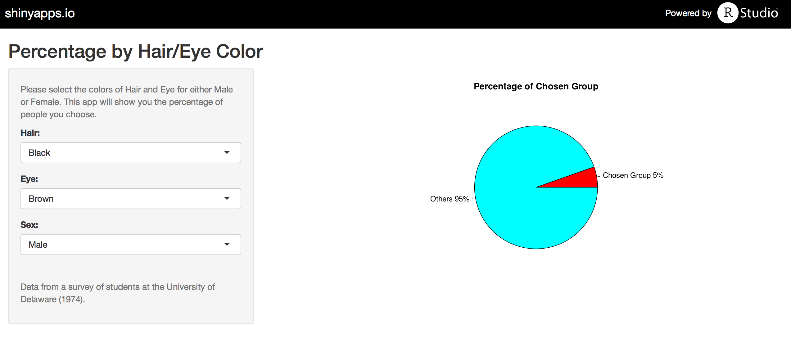

 
## Backgroud
 
- ### [This app] (https://zyqfrog10.shinyapps.io/HairEyeColor) will help you find the percentage of chosen people with certain characteristics (Hair/Eye color and sex). 

- ### This application is based on the 'HairEyeColor' dataset in the R datasets.

- ### 'HairEyeColor' describes the distribution of hair and eye color and sex in 592 statistics students at the University of Delaware in 1974. You can find more details on this dataset at https://stat.ethz.ch/R-manual/R-patched/library/datasets/html/HairEyeColor.html

---

## Overview of the 'HairEyeColor' dataset

```
## Number of cases in table: 592 
## Number of factors: 3 
## Test for independence of all factors:
## 	Chisq = 164.92, df = 24, p-value = 5.321e-23
## 	Chi-squared approximation may be incorrect
```

---

## How to use

### From the pull-down box, choose

- <h3> the color of Hair (Black, Brown, Red, Blond) </h3>
- <h3> the color of Eye (Brown, Blue, Hazel, Green) </h3>
- <h3> the gender (Male or Female) </h3>

### Output: a piechart showing you the percentage of people you choose in the dataset
 

---

## Example 



